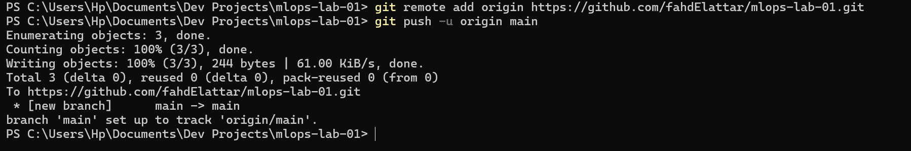
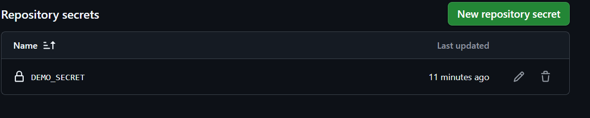
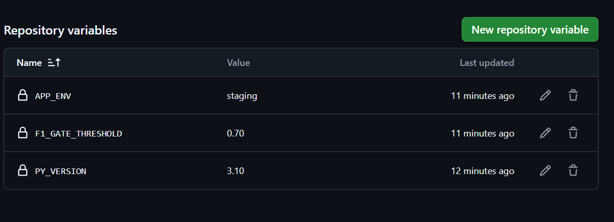
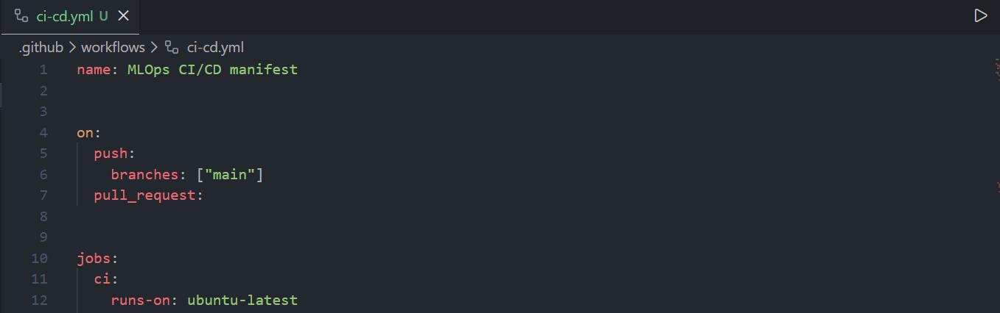
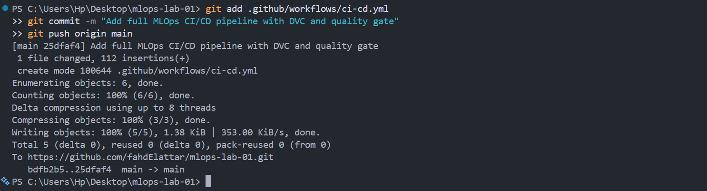

# Livrables du Lab MLOps : Lab 4 – Mise en place d’un pipeline CI/CD pour un projet Machine Learning

## Compte Rendu  
**Réalisé par : Fahd El Attar**

Ce laboratoire a pour objectif de mettre en place un **pipeline CI/CD complet** pour un projet de Machine Learning, en s’appuyant sur :
- **GitHub**
- **GitHub Actions** 
- **DVC**
- Des **secrets sécurisés**
  
L’objectif final est d’automatiser les étapes clés du cycle de vie ML : validation, reproductibilité et exécution contrôlée.

---

## Étape 1 : Connexion du projet au dépôt GitHub

Connexion du projet `mlops-lab-01` au repository GitHub :

---

## Étape 2 : Configuration des secrets GitHub

Création des secrets nécessaires au fonctionnement du pipeline CI/CD :

Ajout des variables sensibles (ex. credentials, chemins, tokens) :

> Ces secrets permettent au pipeline d’accéder au remote DVC et d’exécuter les étapes sans exposer d’informations sensibles dans le code.

---

## Étape 3 : Création du workflow CI/CD

Création du dossier `.github/workflows` :

Ajout du workflow CI/CD (`ci-cd.yml`) :

Ajout du fichier de workflow au versionnement Git :

---

## Étape 4 : Commit, push et vérification du pipeline

Commit et push des modifications vers GitHub, puis vérification de l’exécution du pipeline CI/CD :

---

## Conclusion

Ce laboratoire a permis de mettre en place un **pipeline CI/CD fonctionnel pour un projet Machine Learning**, intégrant :

- L’automatisation via **GitHub Actions**
- La sécurisation des accès grâce aux **GitHub Secrets**
- L’intégration avec **DVC** pour garantir la reproductibilité
- Une exécution contrôlée et traçable à chaque push

Ce pipeline constitue une **brique essentielle d’un système MLOps professionnel**, prêt pour l’industrialisation, les tests automatisés et le déploiement continu.
